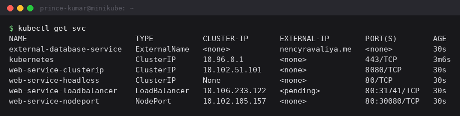
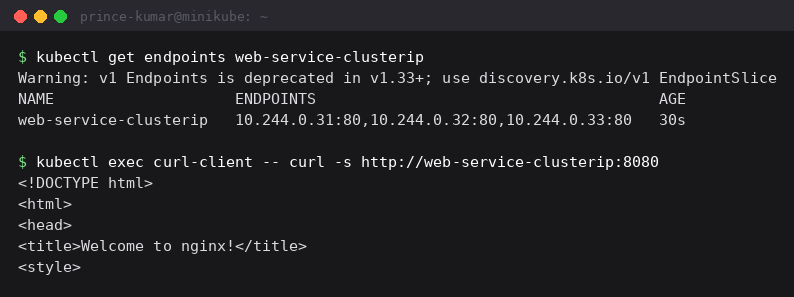
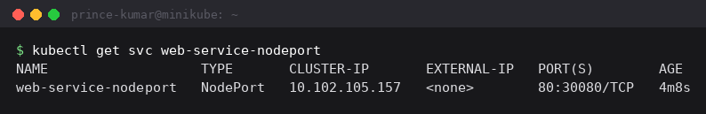
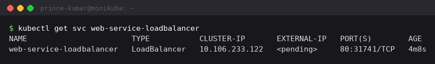
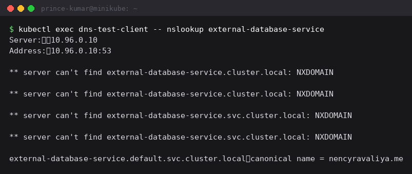
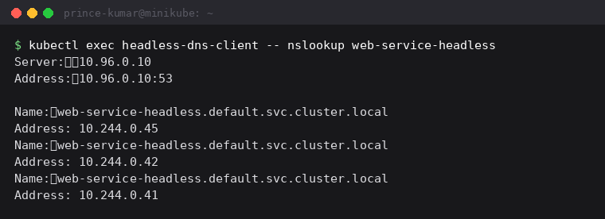

Session 11 - Kubernetes services

Applied all five service types from the session folders and tested how each one is actually
reached. Output copied from my terminal.

```
kubectl apply -f 01-clusterip/ -f 02-nodeport/ -f 03-loadbalancer/ -f 04-externalname/ -f 05-headless/
```

```
$ kubectl get svc
NAME                        TYPE           CLUSTER-IP       EXTERNAL-IP        PORT(S)        AGE
external-database-service   ExternalName   <none>           nencyravaliya.me   <none>         30s
kubernetes                  ClusterIP      10.96.0.1        <none>             443/TCP        3m6s
web-service-clusterip       ClusterIP      10.102.51.101    <none>             8080/TCP       30s
web-service-headless        ClusterIP      None             <none>             80/TCP         30s
web-service-loadbalancer    LoadBalancer   10.106.233.122   <pending>          80:31741/TCP   30s
web-service-nodeport        NodePort       10.102.105.157   <none>             80:30080/TCP   30s
```



All five in one table, and the CLUSTER-IP column already tells most of the story: a normal
virtual IP for ClusterIP, NodePort and LoadBalancer, `None` for the headless one, and
nothing at all for ExternalName.

---

## 1. ClusterIP

The default type, reachable only from inside the cluster.

```
$ kubectl get endpoints web-service-clusterip
Warning: v1 Endpoints is deprecated in v1.33+; use discovery.k8s.io/v1 EndpointSlice
NAME                    ENDPOINTS                                      AGE
web-service-clusterip   10.244.0.31:80,10.244.0.32:80,10.244.0.33:80   30s

$ kubectl exec curl-client -- curl -s http://web-service-clusterip:8080
<!DOCTYPE html>
<html>
<head>
<title>Welcome to nginx!</title>
```



The ENDPOINTS column is what made services click for me. A Service is not a proxy process
sitting in front of the pods - it is a selector plus a list of pod IPs that currently match
it. Those three IPs (.31, .32, .33) are exactly the three `web-app-clusterip` pods from
`kubectl get pods -o wide`. kube-proxy turns that list into network rules on every node.
When a pod dies its IP drops off the list and a replacement's IP is added, while the name
and cluster IP never change - that stability is the entire point.

The port mapping is worth noting: `port: 8080` is what I curl, `targetPort: 80` is where
nginx actually listens. They do not have to match.

The deprecation warning is just Kubernetes moving from `Endpoints` to `EndpointSlice`, which
holds the same information in a form that scales to thousands of pods.

## 2. NodePort

```
$ kubectl get svc web-service-nodeport
NAME                   TYPE       CLUSTER-IP       EXTERNAL-IP   PORT(S)        AGE
web-service-nodeport   NodePort   10.102.105.157   <none>        80:30080/TCP   30s
```



`80:30080/TCP` reads as: port 80 on the service, port 30080 opened on every node in the
cluster. Anything that can reach a node IP can reach the app on that port. The allowed
range is 30000-32767 by default.

A NodePort is still a ClusterIP underneath - it adds the node port on top of one rather
than replacing it, which is why it still has a cluster IP of its own.

With the Docker driver the node is itself a container, so browsing to
`192.168.49.2:30080` from outside does not necessarily work. `minikube service
web-service-nodeport --url` opens a tunnel and hands back a localhost URL instead, and that
command has to stay running for the tunnel to stay open.

## 3. LoadBalancer

```
$ kubectl get svc web-service-loadbalancer
NAME                       TYPE           CLUSTER-IP       EXTERNAL-IP   PORT(S)        AGE
web-service-loadbalancer   LoadBalancer   10.106.233.122   <pending>     80:31741/TCP   30s
```



EXTERNAL-IP sits on `<pending>` and that is expected, not a failure. A LoadBalancer service
asks the cloud provider's controller to provision a real load balancer and report back an
IP. On minikube there is no cloud controller, so nothing ever answers and it waits forever.
Running `minikube tunnel` in a second terminal simulates one and fills the IP in.

Notice it still got a node port (31741) even though I never asked for one. That is the
stacking: ClusterIP -> NodePort -> LoadBalancer, each built on the one below. A LoadBalancer
service has all three.

## 4. ExternalName

```
$ kubectl get svc external-database-service
NAME                        TYPE           CLUSTER-IP   EXTERNAL-IP        PORT(S)   AGE
external-database-service   ExternalName   <none>       nencyravaliya.me   <none>    30s

$ kubectl exec dns-test-client -- nslookup external-database-service
Server:		10.96.0.10
Address:	10.96.0.10:53

** server can't find external-database-service.cluster.local: NXDOMAIN

** server can't find external-database-service.svc.cluster.local: NXDOMAIN

external-database-service.default.svc.cluster.local	canonical name = nencyravaliya.me
```



No cluster IP, no selector, no endpoints, no pods at all. It is purely a DNS alias - CoreDNS
answers with a CNAME pointing at a name outside the cluster.

The NXDOMAIN lines above the answer are not errors. The pod's `/etc/resolv.conf` has a
search list, so nslookup tries `external-database-service.cluster.local` and
`external-database-service.svc.cluster.local` first, and only
`external-database-service.default.svc.cluster.local` is the real name. That is also why
nslookup exits non-zero even though it printed the right answer.

Why it is useful: my app config can always say `external-database-service`, and if the
managed database's hostname changes I edit one Service instead of redeploying every app
that talks to it. It also means I could later move that database into the cluster as a real
Service and the name the app uses would never change.

## 5. Headless service

```
$ kubectl get svc web-service-headless
NAME                   TYPE        CLUSTER-IP   EXTERNAL-IP   PORT(S)   AGE
web-service-headless   ClusterIP   None         <none>        80/TCP    30s

$ kubectl exec headless-dns-client -- nslookup web-service-headless
Server:		10.96.0.10
Address:	10.96.0.10:53

Name:	web-service-headless.default.svc.cluster.local
Address: 10.244.0.45
Name:	web-service-headless.default.svc.cluster.local
Address: 10.244.0.42
Name:	web-service-headless.default.svc.cluster.local
Address: 10.244.0.41

$ kubectl get pods -l app=web-headless -o wide
NAME             READY   STATUS    RESTARTS   AGE   IP            NODE
web-stateful-0   1/1     Running   0          31s   10.244.0.41   minikube
web-stateful-1   1/1     Running   0          29s   10.244.0.42   minikube
web-stateful-2   1/1     Running   0          28s   10.244.0.45   minikube
```



`clusterIP: None` is what makes it headless. Instead of one virtual IP that kube-proxy load
balances behind, the DNS lookup returns **all three pod IPs directly** - and they match the
three StatefulSet pods exactly (.41, .42, .45).

So there is no load balancing happening here at all. The client receives the real list and
decides for itself which pod to talk to. That is exactly what stateful systems need: with a
database cluster I have to send writes to the primary specifically, not to whichever replica
kube-proxy happens to pick. Combined with a StatefulSet each pod also gets its own stable
DNS name, so `web-stateful-0.web-service-headless` is individually addressable no matter how
many times it restarts.

The AGE column shows the same ordered startup as session 10 - 31s, 29s, 28s, one at a time.

---

What I learned:

The three ordinary types stack rather than compete. ClusterIP gives an internal virtual IP,
NodePort adds a port on every node, LoadBalancer adds an external load balancer in front of
that. The `80:31741/TCP` on my LoadBalancer service is the proof - it got a node port
without asking.

Services select pods by **labels**, never by name or IP. If the selector matches nothing,
the endpoint list comes back empty and every request fails even though `kubectl get svc`
looks completely healthy. Checking `kubectl get endpoints` is the first debugging step when
a service does not respond.

The DNS name is always `<service>.<namespace>.svc.cluster.local`. Short names work inside
the same namespace because of the search suffixes in resolv.conf, which is exactly what
those NXDOMAIN lines in the ExternalName lookup were showing - it tries each suffix in turn
until one resolves.

One practical thing: my first attempt at all three `kubectl exec` tests failed with
`unable to upgrade connection: container not found`, because I ran them 30 seconds after
applying and the client pods were still in `ContainerCreating`. The pods have to be Running
before exec works.
