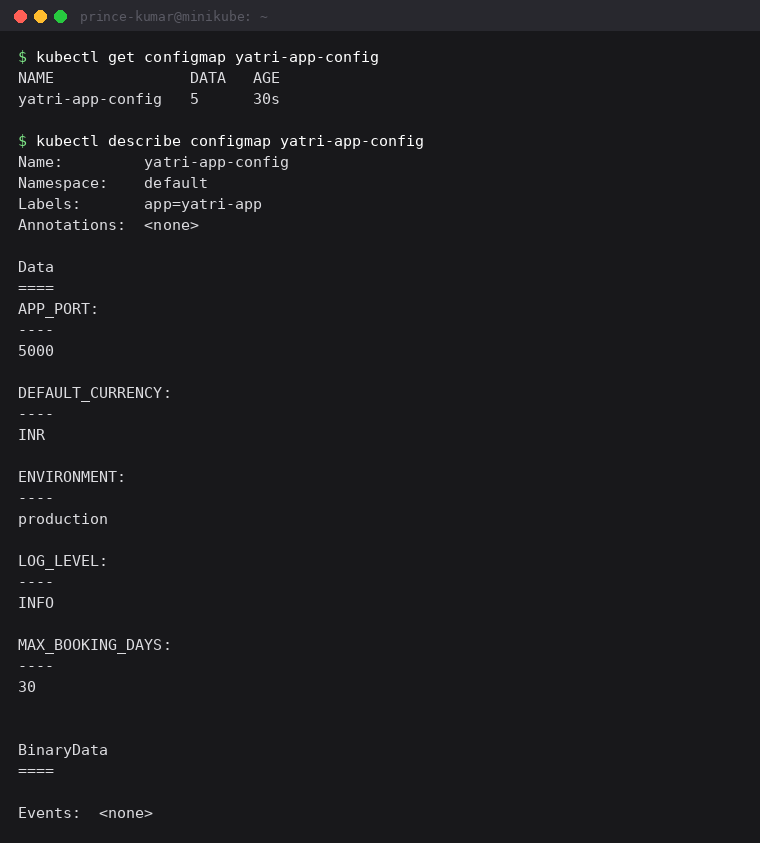
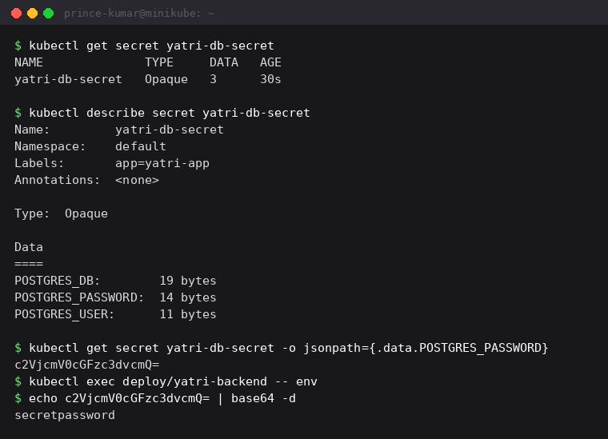
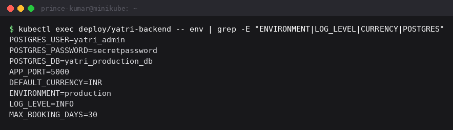
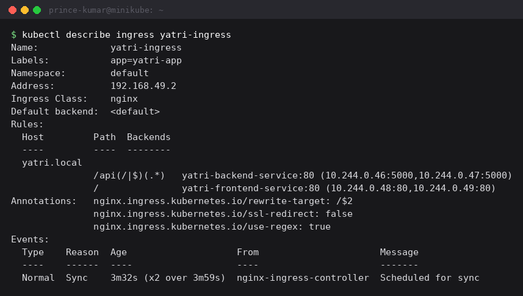
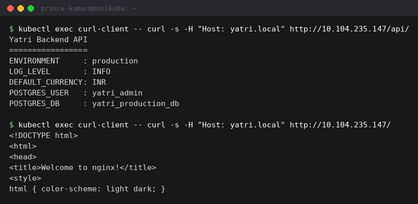

Session 12 - Ingress, ConfigMaps and Secrets

Used the full demo from `04-full-demo/`: a ConfigMap and a Secret feeding a backend, an
nginx frontend, and one Ingress routing `/` and `/api/` to the two different services.
Output copied from my terminal.

```
$ kubectl apply -f 04-full-demo/
deployment.apps/yatri-backend created
service/yatri-backend-service created
configmap/yatri-app-config created
deployment.apps/yatri-frontend created
service/yatri-frontend-service created
ingress.networking.k8s.io/yatri-ingress created
secret/yatri-db-secret created
```

---

## 1. ConfigMap

```
$ kubectl get configmap yatri-app-config
NAME               DATA   AGE
yatri-app-config   5      30s

$ kubectl describe configmap yatri-app-config
Name:         yatri-app-config
Namespace:    default
Labels:       app=yatri-app
Data
====
APP_PORT:
----
5000
DEFAULT_CURRENCY:
----
INR
ENVIRONMENT:
----
production
LOG_LEVEL:
----
INFO
MAX_BOOKING_DAYS:
----
30
```



Plain key/value configuration stored in the cluster instead of baked into the image. That is
the whole point - the same image runs in dev and in production and only the ConfigMap
differs, so a config change does not need a rebuild. `describe` prints every value in full
because none of it is sensitive.

## 2. Secret

```
$ kubectl get secret yatri-db-secret
NAME              TYPE     DATA   AGE
yatri-db-secret   Opaque   3      30s

$ kubectl describe secret yatri-db-secret
Name:         yatri-db-secret
Namespace:    default
Labels:       app=yatri-app
Type:  Opaque
Data
====
POSTGRES_DB:        19 bytes
POSTGRES_PASSWORD:  14 bytes
POSTGRES_USER:      11 bytes
```



`describe` deliberately shows only **byte counts** instead of values, so a password cannot
end up in a terminal scrollback or a CI log by accident.

That is only hiding it from the output though. It is not encryption:

```
$ kubectl get secret yatri-db-secret -o jsonpath='{.data.POSTGRES_PASSWORD}'
c2VjcmV0cGFzc3dvcmQ=

$ echo 'c2VjcmV0cGFzc3dvcmQ=' | base64 -d
secretpassword
```

Base64 is an encoding, so anyone allowed to read the Secret can decode it in one command.
The real protection is RBAC - controlling who can `get secrets` in the first place - plus
turning on encryption at rest, because by default etcd stores Secret values unencrypted.

The yaml holds values already base64'd, produced with `echo -n "secretpassword" | base64`.
The `-n` matters: without it the trailing newline gets encoded into the value and the
password is wrong by one character.

## 3. Injecting both into a pod

The backend pulls the whole ConfigMap in with `envFrom` and each secret key with
`secretKeyRef`:

```yaml
envFrom:
  - configMapRef:
      name: yatri-app-config
env:
  - name: POSTGRES_PASSWORD
    valueFrom:
      secretKeyRef:
        name: yatri-db-secret
        key: POSTGRES_PASSWORD
```

```
$ kubectl exec deploy/yatri-backend -- env | grep -E "ENVIRONMENT|LOG_LEVEL|CURRENCY|POSTGRES"
POSTGRES_USER=yatri_admin
POSTGRES_PASSWORD=secretpassword
POSTGRES_DB=yatri_production_db
APP_PORT=5000
DEFAULT_CURRENCY=INR
ENVIRONMENT=production
LOG_LEVEL=INFO
MAX_BOOKING_DAYS=30
```



This is the part that tied the two objects together for me. ConfigMap values and Secret
values both arrive as **ordinary environment variables** inside the container. The
application just reads `os.getenv("POSTGRES_PASSWORD")` and has no idea which object it came
from, and the base64 is decoded automatically on the way in.

It also makes the limitation obvious - `POSTGRES_PASSWORD=secretpassword` is sitting there
in plain text, so anyone who can exec into the pod can read it. Mounting a Secret as a
volume is slightly better, because volume mounted secrets update when the Secret changes
while env vars are fixed at container start.

## 4. Ingress

The controller has to exist first, otherwise the Ingress object is just a rule nobody reads:

```
minikube addons enable ingress
```

```
$ kubectl get ingress yatri-ingress
NAME            CLASS   HOSTS         ADDRESS        PORTS   AGE
yatri-ingress   nginx   yatri.local   192.168.49.2   80      30s

$ kubectl describe ingress yatri-ingress
Name:             yatri-ingress
Labels:           app=yatri-app
Namespace:        default
Address:          192.168.49.2
Ingress Class:    nginx
Default backend:  <default>
Rules:
  Host         Path  Backends
  ----         ----  --------
  yatri.local
               /api(/|$)(.*)   yatri-backend-service:80 (10.244.0.46:5000,10.244.0.47:5000)
               /               yatri-frontend-service:80 (10.244.0.48:80,10.244.0.49:80)
Annotations:   nginx.ingress.kubernetes.io/rewrite-target: /$2
               nginx.ingress.kubernetes.io/ssl-redirect: false
               nginx.ingress.kubernetes.io/use-regex: true
Events:
  Type    Reason  Age                    From                      Message
  ----    ------  ----                   ----                      -------
  Normal  Sync    3m32s (x2 over 3m59s)  nginx-ingress-controller  Scheduled for sync
```



The Backends column is the one to check - each rule has resolved to real pod IPs, two
backend pods on port 5000 and two frontend pods on port 80.

The first time I described this, the `/api` rule showed `yatri-backend-service:80 ()` with
an **empty** backend list, because the backend pods were still in `ContainerCreating` and no
pod had passed its readiness check yet. An empty list there means the ingress has nowhere to
send traffic and would return 503. Once the pods went Ready the IPs appeared. That is the
same lesson as the Service endpoints in session 11 - the rule can be perfectly correct and
still serve nothing if no pod is backing it.

ADDRESS shows `192.168.49.2`, the node IP, which is where the ingress controller is
listening.

## 5. Testing the routing

`yatri.local` is not in my hosts file, so I curled the ingress controller from inside the
cluster and set the Host header by hand:

```
$ kubectl exec curl-client -- curl -s -H "Host: yatri.local" http://10.104.235.147/api/
Yatri Backend API
=================
ENVIRONMENT     : production
LOG_LEVEL       : INFO
DEFAULT_CURRENCY: INR
POSTGRES_USER   : yatri_admin
POSTGRES_DB     : yatri_production_db

$ kubectl exec curl-client -- curl -s -H "Host: yatri.local" http://10.104.235.147/
<!DOCTYPE html>
<html>
<head>
<title>Welcome to nginx!</title>
```



Same IP, same port 80, two completely different applications - the only thing that differs
is the path. `/api/` reached the Python backend and `/` reached the nginx frontend. That is
the entire value of Ingress: one entry point in front of many services, instead of a
separate LoadBalancer (and a separate cloud bill) for each one.

The `/api/` response is also end to end proof that the ConfigMap and Secret injection
worked - those values were read out of the environment variables by the backend at startup
and printed back to me through the ingress.

Two details matter here:

- The `Host: yatri.local` header is what selects the rule. Without it the controller cannot
  tell which site is being requested and falls through to the default backend with a 404.
- `rewrite-target: /$2` combined with the path `/api(/|$)(.*)` strips the `/api` prefix
  before forwarding, so the backend receives `/` and not `/api/`. The `(.*)` is the second
  capture group, which is what `$2` refers to.

---

What I learned:

ConfigMap and Secret are the same idea - key/value data stored outside the image - and the
only real differences are that Secret is base64 encoded, hidden from `describe`, and can be
locked down separately with RBAC. Neither is encrypted by default, which I proved by
decoding the password in one command.

Service is layer 4 and Ingress is layer 7. A Service only sees IP and port, so it cannot
tell `/api` from `/`. An Ingress reads the actual HTTP request - the host header and the
path - which is why a single Ingress can sit in front of many services.

An Ingress resource on its own does nothing at all. It is only a set of rules, and it needs
an ingress controller running in the cluster to read those rules and route traffic. That is
the thing that catches people out, and it is why `minikube addons enable ingress` is a
required step and not an optional extra.
