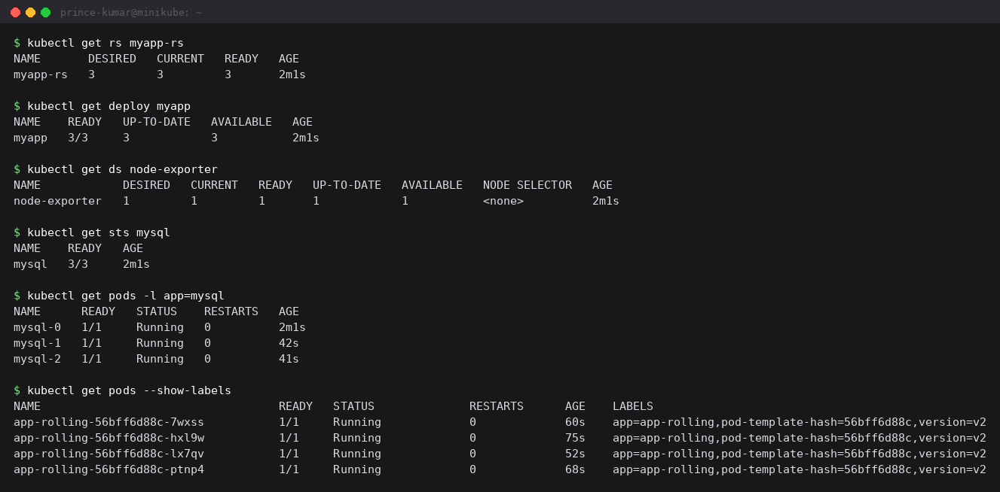
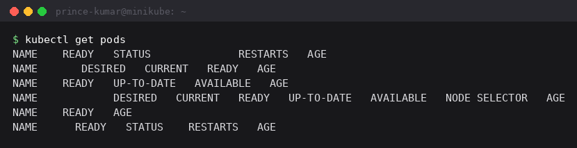
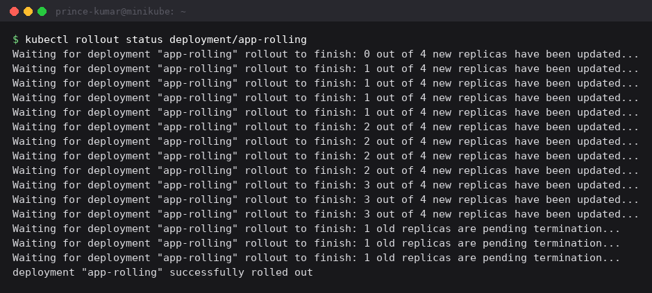

Session 10 - Kubernetes core objects

Three parts: the core objects (Pod, ReplicaSet, Deployment, DaemonSet, StatefulSet), the
pod lifecycle states, and a rolling update followed by a rollback. All output copied from
my terminal.

---

## 1. Core objects

```
$ kubectl apply -f k8s-core-objects/
daemonset.apps/node-exporter created
deployment.apps/myapp created
pod/mypod created
replicaset.apps/myapp-rs created
statefulset.apps/mysql created
```

```
$ kubectl get rs myapp-rs
NAME       DESIRED   CURRENT   READY   AGE
myapp-rs   3         3         3       2m1s

$ kubectl get deploy myapp
NAME    READY   UP-TO-DATE   AVAILABLE   AGE
myapp   3/3     3            3           2m1s

$ kubectl get ds node-exporter
NAME            DESIRED   CURRENT   READY   UP-TO-DATE   AVAILABLE   NODE SELECTOR   AGE
node-exporter   1         1         1       1            1           <none>          2m1s

$ kubectl get sts mysql
NAME    READY   AGE
mysql   3/3     2m1s

$ kubectl get pods -l app=mysql
NAME      READY   STATUS    RESTARTS   AGE
mysql-0   1/1     Running   0          2m1s
mysql-1   1/1     Running   0          42s
mysql-2   1/1     Running   0          41s
```



The DaemonSet says DESIRED 1 because my cluster has one node. A DaemonSet means "one copy
on every node", so adding a second node would make it 2 automatically without me changing
anything. That is why log collectors and monitoring agents are DaemonSets.

The StatefulSet pods are the interesting ones. They are named `mysql-0`, `mysql-1`,
`mysql-2` instead of getting random hashes like Deployment pods do, and look at the AGE
column - `mysql-0` is 2m1s old while `mysql-1` is 42s and `mysql-2` is 41s. That gap is the
ordered startup: a StatefulSet starts one pod at a time and waits for each to be ready
before starting the next. `mysql-0` had to pull the mysql:5.7 image first, which is why the
gap is over a minute here, and the last two started a second apart once the image was
cached.

A first run 15 seconds after applying showed everything at `0/N ContainerCreating`, because
on a brand new cluster every image has to be downloaded before anything can start.

## 2. Deployment vs ReplicaSet

```
$ kubectl get rs
NAME               DESIRED   CURRENT   READY   AGE
myapp-5b9587f95d   3         3         0       15s
myapp-rs           3         3         0       15s

$ kubectl get pods --show-labels
NAME                     READY   STATUS    AGE    LABELS
myapp-5b9587f95d-2hbnp   1/1     Running   2m1s   app=myapp,pod-template-hash=5b9587f95d
myapp-5b9587f95d-566nr   1/1     Running   2m1s   app=myapp,pod-template-hash=5b9587f95d
myapp-5b9587f95d-ttj2p   1/1     Running   2m1s   app=myapp,pod-template-hash=5b9587f95d
myapp-rs-46pzn           1/1     Running   2m1s   app=web
myapp-rs-725dj           1/1     Running   2m1s   app=web
myapp-rs-7snzn           1/1     Running   2m1s   app=web
```

I created one Deployment and one ReplicaSet, but `kubectl get rs` lists **two**
ReplicaSets. That is because a Deployment does not manage pods itself - it creates a
ReplicaSet (`myapp-5b9587f95d`) and that manages the pods. So the chain is:

```
Deployment -> ReplicaSet -> Pod
```

The difference is visible in the labels. The Deployment's pods carry an extra
`pod-template-hash=5b9587f95d` label that my hand written ReplicaSet's pods do not have.
That hash is derived from the pod template, and it is what lets a Deployment tell one
version's pods apart from another's - which is exactly what makes rolling updates possible
in part 4.

## 3. Pod lifecycle

```
$ kubectl get pods
NAME                        READY   STATUS             RESTARTS      AGE
lifecycle-crashloop         0/1     Error              2 (29s ago)   106s
lifecycle-image-error       0/1     ImagePullBackOff   0             105s
lifecycle-init              0/1     PodInitializing    0             105s
lifecycle-multi-container   2/2     Running            0             105s
```



**CrashLoopBackOff** - I caught this one at `Error` with 2 restarts, which is the moment
right after the container exited and before Kubernetes restarts it again. The cycle is
Running -> Error -> CrashLoopBackOff -> Running, so the STATUS depends entirely on when you
look. The RESTARTS counter is the reliable signal, not STATUS.

The current container's logs are useless for debugging because it has only just started, so
I need the previous one:

```
$ kubectl logs lifecycle-crashloop --previous
unable to retrieve container logs for containerd://0fefbef03f910829b07c1007cc30214919a5275e688d0db79f3546f6a27f4e1b
```

I did not get logs back here, and that is worth recording rather than hiding. The previous
container had already been garbage collected by the kubelet by the time I asked, so there
was nothing left on disk to read. On a pod that has been crashing for a while `--previous`
usually does work - the lesson is to grab the logs while the failure is fresh, or to ship
them off the node with a log agent so they survive the container.

"BackOff" means the wait between restarts doubles each time (10s, 20s, 40s, capped at 5
minutes) so a permanently broken app does not get restarted in a tight loop forever.

**ImagePullBackOff** - the image cannot be downloaded so the container never starts at all.
`ErrImagePull` is the pull failing right now and `ImagePullBackOff` is the wait before the
next attempt. The reason only shows up in describe:

```
$ kubectl describe pod lifecycle-image-error
Status:           Pending
Containers:
  broken-image:
    Image:          jakwehrgkaejw:kahsdfgkhj
    State:          Waiting
      Reason:       ImagePullBackOff
Conditions:
  Type                        Status
  PodReadyToStartContainers   True
  Initialized                 True
  Ready                       False
  ContainersReady             False
  PodScheduled                True
Events:
  Type    Reason     Age   From               Message
  ----    ------     ----  ----               -------
  Normal  Scheduled  30s   default-scheduler  Successfully assigned default/lifecycle-image-error to minikube
  Normal  Pulling    30s   kubelet            spec.containers{broken-image}: Pulling image "jakwehrgkaejw:kahsdfgkhj"
```

The Conditions block shows exactly how far it got: `PodScheduled` and `Initialized` are
True, `ContainersReady` is False. The scheduler did its job, the image is the problem.

These two failures look similar in `get pods` but are completely different: CrashLoopBackOff
means my **application code** is broken, ImagePullBackOff means my **image name, tag or
registry access** is broken.

**Init containers** run to completion before the main container is allowed to start. I
caught this one at `PodInitializing`, which is the state after the init container finished
and before the main container is up:

```
$ kubectl logs lifecycle-init -c setup
Init container running
Init complete
```

Used for things like waiting on a database or fetching config first.

**Multi-container** - `2/2` means both containers are ready. They share a network namespace
so they can reach each other on localhost, and any logs command needs `-c` to pick one:

```
$ kubectl logs lifecycle-multi-container -c sidecar
Sidecar is running
Sidecar is running
Sidecar is running
```

## 4. Rolling update and rollback

Started on v1 (`nginx:1.24-alpine`) with 4 replicas, then applied v2 (`nginx:1.25-alpine`):

```
$ kubectl apply -f 01-rolling-update/deployment-v2.yaml
deployment.apps/app-rolling configured

$ kubectl rollout status deployment/app-rolling
Waiting for deployment "app-rolling" rollout to finish: 0 out of 4 new replicas have been updated...
Waiting for deployment "app-rolling" rollout to finish: 1 out of 4 new replicas have been updated...
Waiting for deployment "app-rolling" rollout to finish: 2 out of 4 new replicas have been updated...
Waiting for deployment "app-rolling" rollout to finish: 3 out of 4 new replicas have been updated...
Waiting for deployment "app-rolling" rollout to finish: 1 old replicas are pending termination...
deployment "app-rolling" successfully rolled out
```



```
$ kubectl get pods -l app=app-rolling --show-labels
NAME                           READY   STATUS        RESTARTS   AGE   LABELS
app-rolling-56bff6d88c-7wxss   1/1     Running       0          15s   app=app-rolling,pod-template-hash=56bff6d88c,version=v2
app-rolling-56bff6d88c-hxl9w   1/1     Running       0          30s   app=app-rolling,pod-template-hash=56bff6d88c,version=v2
app-rolling-56bff6d88c-lx7qv   1/1     Running       0          7s    app=app-rolling,pod-template-hash=56bff6d88c,version=v2
app-rolling-56bff6d88c-ptnp4   1/1     Running       0          23s   app=app-rolling,pod-template-hash=56bff6d88c,version=v2
app-rolling-86d7d44d5b-hv87s   0/1     Terminating   0          60s   app=app-rolling,pod-template-hash=86d7d44d5b,version=v1
app-rolling-86d7d44d5b-m4s6k   0/1     Terminating   0          60s   app=app-rolling,pod-template-hash=86d7d44d5b,version=v1
```

The AGE values on the v2 pods - 30s, 23s, 15s, 7s - show they were created **one at a
time**, roughly 7 to 8 seconds apart, not all at once. That is the strategy in the yaml:

```yaml
strategy:
  type: RollingUpdate
  rollingUpdate:
    maxSurge: 1
    maxUnavailable: 0
```

`maxUnavailable: 0` means it is never allowed to drop below 4 ready pods, and `maxSurge: 1`
lets it temporarily run a 5th. So it adds one new pod, waits for it to become ready, then
terminates one old pod, and repeats. That ordering is what gives zero downtime. Setting
`maxUnavailable: 1` instead would be faster but would serve traffic on 3 pods mid-update.

Rollback:

```
$ kubectl rollout history deployment/app-rolling
deployment.apps/app-rolling
REVISION  CHANGE-CAUSE
1         <none>
2         <none>

$ kubectl rollout undo deployment/app-rolling
Warning: resource deployments/app-rolling was previously managed with 'kubectl apply'.
Rolling back will not update the kubectl.kubernetes.io/last-applied-configuration annotation,
which may cause unexpected behavior on future 'kubectl apply' operations.
deployment.apps/app-rolling rolled back

$ kubectl get pods -l app=app-rolling --show-labels
NAME                           READY   STATUS        RESTARTS   AGE   LABELS
app-rolling-56bff6d88c-7wxss   1/1     Running       0          16s   app=app-rolling,pod-template-hash=56bff6d88c,version=v2
app-rolling-86d7d44d5b-2l8jp   0/1     Pending       0          0s    app=app-rolling,pod-template-hash=86d7d44d5b,version=v1
```

CHANGE-CAUSE is `<none>` for both revisions because I used plain `kubectl apply`. Passing
`--record` or setting the `kubernetes.io/change-cause` annotation would put the command in
that column, which matters on a real system where you need to know what revision 2 actually
was.

The important detail is the hash. The new v1 pod is `86d7d44d5b` - the **same hash** as the
original v1 pods before the update. And the ReplicaSet list explains why:

```
$ kubectl get rs -l app=app-rolling
NAME                     DESIRED   CURRENT   READY   AGE
app-rolling-56bff6d88c   4         4         4       31s
app-rolling-86d7d44d5b   1         1         0       61s
```

The old ReplicaSet was never deleted. It was scaled down to 0 and is now being scaled back
up. A rollback is just scaling the old ReplicaSet up and the new one down, which is why it
is nearly instant - there is nothing to rebuild.

---

What I learned:

A Deployment creates a ReplicaSet per version and keeps the old ones around at 0 replicas.
That single fact explains both how rolling updates work and why `rollout undo` is instant.

Never use a bare Pod for real work:

```
$ kubectl delete pod mypod
pod "mypod" deleted from default namespace
$ kubectl get pod mypod
Error from server (NotFound): pods "mypod" not found

$ kubectl delete pod myapp-rs-46pzn
pod "myapp-rs-46pzn" deleted from default namespace
$ kubectl get pods -l app=web
NAME             READY   STATUS              RESTARTS   AGE
myapp-rs-5598g   0/1     ContainerCreating   0          1s
myapp-rs-725dj   1/1     Running             0          3m47s
myapp-rs-7snzn   1/1     Running             0          3m47s
```

The bare pod is simply gone. The ReplicaSet's pod came back within seconds under a new name
because the controller saw the count was short and reconciled.

For debugging: RESTARTS climbing means the application is failing, while 0 restarts and not
ready means the image or config never got far enough to run. And `kubectl logs --previous`
is the one I would not have worked out on my own, because the current container's logs are
empty when it has only just restarted.
