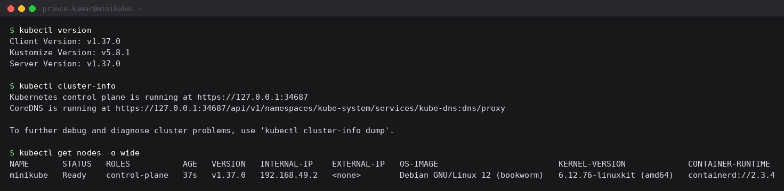
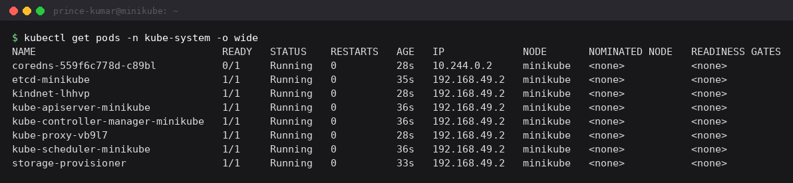
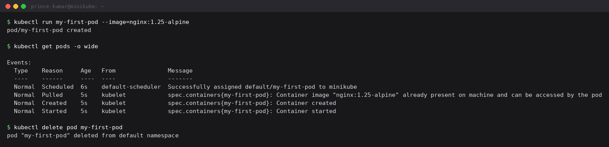

Session 9 - Kubernetes fundamentals

Set up a single node cluster with minikube on the Docker driver and worked through the
basic kubectl commands - cluster info, nodes, namespaces, and running a first pod.
Everything below is copied from my terminal.

```
minikube start --driver=docker
```

---

## 1. Cluster info

```
$ kubectl version
Client Version: v1.37.0
Kustomize Version: v5.8.1
Server Version: v1.37.0

$ kubectl cluster-info
Kubernetes control plane is running at https://127.0.0.1:34687
CoreDNS is running at https://127.0.0.1:34687/api/v1/namespaces/kube-system/services/kube-dns:dns/proxy

$ kubectl get nodes -o wide
NAME       STATUS   ROLES           AGE   VERSION   INTERNAL-IP    OS-IMAGE                         CONTAINER-RUNTIME
minikube   Ready    control-plane   37s   v1.37.0   192.168.49.2   Debian GNU/Linux 12 (bookworm)   containerd://2.3.4
```



Only one node, and its ROLES says `control-plane`, so this single machine is both the
control plane and the worker. On a real cluster those would be separate machines and the
workers would carry the workloads.

The control plane URL is `127.0.0.1:34687` rather than the node IP because the Docker
driver runs the node as a container and forwards a random local port to the API server.

## 2. Namespaces

```
$ kubectl get namespaces
NAME              STATUS   AGE
default           Active   37s
kube-node-lease   Active   37s
kube-public       Active   37s
kube-system       Active   37s
```

Four exist from the start. `default` is where my objects land if I do not pass `-n`.
`kube-system` holds Kubernetes' own components. `kube-public` is readable by everyone
including unauthenticated users, and `kube-node-lease` holds the heartbeat objects each
node updates so the control plane can tell quickly when a node goes silent.

## 3. The control plane components are just pods

```
$ kubectl get pods -n kube-system -o wide
NAME                               READY   STATUS    RESTARTS   AGE   IP             NODE
coredns-559f6c778d-c89bl           0/1     Running   0          28s   10.244.0.2     minikube
etcd-minikube                      1/1     Running   0          35s   192.168.49.2   minikube
kindnet-lhhvp                      1/1     Running   0          28s   192.168.49.2   minikube
kube-apiserver-minikube            1/1     Running   0          36s   192.168.49.2   minikube
kube-controller-manager-minikube   1/1     Running   0          36s   192.168.49.2   minikube
kube-proxy-vb9l7                   1/1     Running   0          28s   192.168.49.2   minikube
kube-scheduler-minikube            1/1     Running   0          36s   192.168.49.2   minikube
storage-provisioner                1/1     Running   0          33s   192.168.49.2   minikube
```



This is what made the architecture diagram real for me - every box in it is an actual
container I can list with an ordinary kubectl command:

- `kube-apiserver` - the front door. kubectl, the kubelet and the controllers all talk to
  this, and nothing talks to etcd directly.
- `etcd` - the key/value store holding the whole cluster state. Lose it and the cluster is
  gone.
- `kube-scheduler` - watches for pods with no node assigned and picks one for them.
- `kube-controller-manager` - runs the control loops that compare desired state to actual
  state and act on the difference.
- `kube-proxy` - one per node, programs the network rules that make Service IPs work.
- `coredns` - cluster DNS, resolves service names.
- `kindnet` - the CNI plugin, gives each pod its IP.
- `storage-provisioner` - minikube specific, hands out PersistentVolumes automatically.

I caught coredns at `0/1 Running` because I ran this 28 seconds into the cluster's life and
it had not passed its readiness probe yet. Also worth noticing: coredns has a pod IP
(`10.244.0.2`) from the cluster network, while everything else shows `192.168.49.2`, the
node's own IP. Those are the static control-plane pods running in the host network.

`kubelet` is missing from this list because it is not a pod - it is a systemd service on
the node, and it is what actually tells containerd to start containers.

## 4. Node capacity and api-resources

```
$ kubectl describe node minikube | sed -n '/^Capacity/,/^System Info/p'
Capacity:
  cpu:                16
  ephemeral-storage:  200925597696
  memory:             3805052Ki
  pods:               110
Allocatable:
  cpu:                16
  ephemeral-storage:  200925597696
  memory:             3805052Ki
  pods:               110
```

`Capacity` is what the machine physically has, `Allocatable` is what is left for pods after
system reservations. The scheduler only ever looks at Allocatable. The 110 pod limit is a
hard cap regardless of free CPU and memory.

```
$ kubectl api-resources
NAME                     SHORTNAMES   APIVERSION   NAMESPACED   KIND
configmaps               cm           v1           true         ConfigMap
endpoints                ep           v1           true         Endpoints
namespaces               ns           v1           false        Namespace
nodes                    no           v1           false        Node
pods                     po           v1           true         Pod
secrets                               v1           true         Secret
services                 svc          v1           true         Service
```

Useful for two reasons: SHORTNAMES saves typing (`po`, `svc`, `ns`), and NAMESPACED says
whether an object lives in a namespace or is cluster wide. Nodes and namespaces are cluster
wide, which is why `kubectl get nodes -n default` makes no difference.

## 5. My first pod

```
$ kubectl run my-first-pod --image=nginx:1.25-alpine
pod/my-first-pod created

$ kubectl get pods -o wide
NAME           READY   STATUS    RESTARTS   AGE   IP            NODE
my-first-pod   1/1     Running   0          6s    10.244.0.16   minikube
```



```
$ kubectl describe pod my-first-pod
Name:             my-first-pod
Namespace:        default
Node:             minikube/192.168.49.2
Labels:           run=my-first-pod
Status:           Running
IP:               10.244.0.16
Containers:
  my-first-pod:
    Image:          nginx:1.25-alpine
    State:          Running
    Ready:          True
    Restart Count:  0
Conditions:
  Type                        Status
  PodReadyToStartContainers   True
  Initialized                 True
  Ready                       True
  ContainersReady             True
  PodScheduled                True
QoS Class:                   BestEffort
Events:
  Type    Reason     Age   From               Message
  ----    ------     ----  ----               -------
  Normal  Scheduled  6s    default-scheduler  Successfully assigned default/my-first-pod to minikube
  Normal  Pulled     5s    kubelet            Container image "nginx:1.25-alpine" already present on machine and can be accessed by the pod
  Normal  Created    5s    kubelet            Container created
  Normal  Started    5s    kubelet            Container started
```

The two useful sections are at the bottom. **Conditions** go in order -
`PodScheduled` -> `Initialized` -> `ContainersReady` -> `Ready`. When a pod is stuck, the
first one that is False tells me how far it got.

**Events** is the pod's story in order: the scheduler assigned a node, the kubelet got the
image, created the container, started it. The whole thing took one second because the image
says **already present on machine** - it was cached from an earlier run on this cluster, so
there was no download step. The first time I ran this the pod sat in `ContainerCreating`
with only a `Pulling image` event, because it was actually downloading nginx.

`QoS Class: BestEffort` is because I set no resource requests or limits. That means this
pod is first in line to be evicted if the node runs out of memory.

```
$ kubectl delete pod my-first-pod
pod "my-first-pod" deleted from default namespace
```

Because I created it with `kubectl run` and not through a Deployment, deleting it is final -
nothing brings it back.

---

What I learned:

Kubernetes is declarative. I do not run commands that start containers on particular
machines - I record what I want and the controllers reconcile until reality matches. That is
also why a bare pod stays deleted while a Deployment's pod comes straight back.

The control plane is not special infrastructure, it is pods in `kube-system`. Seeing etcd
and the apiserver in an ordinary `kubectl get pods` is what made the diagram click.

`kubectl describe` beats `kubectl get` the moment something is wrong, because `get` shows
only the current status while `describe` shows the Events that explain how it got there.
